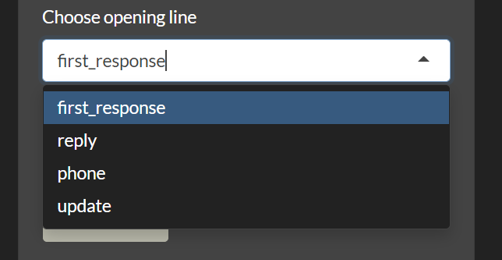
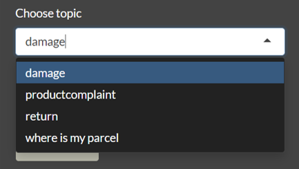

```{r, include = FALSE}
knitr::opts_chunk$set(
  collapse = TRUE,
  comment = "#>"
)
```

```{r setup}
library(EmailTemplate)
```

## Overview

The EmailTemplate Shiny app provides an easy-to-use load-save-and-click interface to create and load Email Templates.

## Starting the Shiny App

After opening RStudio, the application can be started with just a few lines of code. In general, you'll want to load the latest release from CRAN:

```{r, eval = FALSE}
install.packages("shiny")
library(shiny)
install.packages("EmailTemplate")
library(EmailTemplate)
EmailTemplate()
```

## User Guide Tab

When you open the app, you are taken to the User Guide Tab which contains a concise version of the current vignette. At the end of the user guide, you will also find contact information in case you have questions regarding the application, experience issues, or have suggestions for improvement. 

<left>

{width=40%}
</left>

Notable, the user guide is a dropbox-shared pdf and can, hence, only be viewed when opening the application in the browser. 

<left>

{width=50%}
</left>


## Typical Workflow

After opening the app, you will typically follow the workflow below. In short, you will load and save input data, tweak input choices and content, and then copy the resulting email template.

<left>

{width=70%}
</left>

The work flow lines up with the toolbar panels.

<left>

{width=60%}
</left>

More information about each step in the process is described below.


### Create & Select Path to an Excel File

First, you will need to create and save an empty excel file as a *.csv file. When you open the app, you should be able to see a side panel that contains some default topics to choose from. At the top of the side panel you should be able to paste the path to your excel file in the field box titled 'Inputs Location'.

<left>

{width=30%}
</left>

### Configure Sidebarpanel

In the sidebar panel, you can see and edit various input choices (see a picture of the complete sidebar panel below).

<left>

{width=20%}
</left>

#### Salutation

The first input you can edit is titled 'Salutation'. The salutation addresses the person you are sending the email to. By default, the salutation is set to 'Dear...,'. You can insert the recipient's name after the comma or insert a different salutation.

<left>

{width=25%}
</left>

#### Opening Line

The second input you can select from is the 'Choose opening line' input field. The opening of your email introduces the response type of the email. There are four default topics to choose from.  For instance, you would pick the opening line 'reply' if you are responding to a reply of the recipient in question (see a picture of the default choices below).

<left>

{width=35%}
</left>

If you cannot find what you are looking for, you can enter a new choice of the opening line in the text input field. You can add it to the default choices by clicking the 'Add to choices..' button (see a picture of the input field and button below). 

<left>

{width=35%}
</left>

#### Topic

The third input you can choose from is titled 'Choose topic'. This input field refers to the overall topic of your email. In essence, it will set the topic for the main body of your template. The body of an email normally elaborates on the purpose of the email and contains detailed information. Again, there are four default choices (see picture below). 

<left>

{width=35%}
</left>


You can complement those choices by entering a new topic in the empty text field and add it to the set of choices via the 'Add to choices..' button. 

<left>

{width=35%}
</left>

#### Choose Day of Week & Choose Time of Day

The fourth and fifth inputs you can choose from are titled 'Choose day of week' and 'Choose time of day' respectively. You can select the present day of the week and the time of the day. Doing so will compose a day and time-appropriate greeting line (see pictures below). 

<left>

{width=35%}
{width=50%}

</left>


#### Closing Line & Insert your Name

The final inputs to edit are titled 'Closing Line' and 'Insert your Name' respectively. You can sign-off your email with a closing line and seal it with your name. The popular sign off 'kind regards,..' is set as a default, but feel free to insert a different closing line.

<left>

{width=35%}
</left>

#### Save and Load Input Data

You can save the input data and load it the next time you are using the application via the buttons at the bottom of the sidebar panel. To do so, make sure that the correct path to your excel file is displayed in the Inputs Location field. The button 'save inputs' will allow you to export your inputs to the excel file, while the button 'load inputs' will allow you to import your inputs from the excel file. 

<left>

{width=30%}
</left>


Importantly, the excel file cannot be open while saving or loading inputs. If the excel file is open during the export-import processing, the following error will show:

<left>

{width=50%}
</left>

### View Content Editor

After saving, loading, and selecting your choices, navigate to the Content Editor tab to customize the content of the opening line and topic you selected in the side panel.

<left>

{width=50%}
</left>

### Create & Select Path to an Excel File

Once again, you will need to create and save an empty excel file to load and save your input for later usage of the application. Once you have done that, you will need to paste the path to your excel file in the Inputs Location field at the top of the Content Editor tab (see picture below).

<left>

{width=40%}
</left>

### Content Editor

After inserting the path to your excel file, you can customize the content of your email template. For instance, if you chose the opening line 'reply', the first input text field should be titled 'reply'. You could insert something like "Thank you for your reply." in the input field and export it to your excel file (see the red arrows below). Click the 'save inputs' button at the bottom to export your customized input (see orange arrow below) or click the 'load inputs' button to import previously saved inputs (see blue arrow below). Following you should be able to recreate the customized inputs. The input area for the topic of the email is larger to allow you to write more text (see yellow arrow below). 

<left>

{width=35%}
</left>

### View and Export Template

Once you have customized or loaded your content from previous sessions, you can proceed to the Template tab. Here you can view what the complete email template looks like. If you are satisfied with the result, you can copy it and insert it into your email draft. An example template is displayed in the picture below.

<left>

{width=50%}
</left>

### Excel Table

What should your Excel table look like?

#### First Excel Table

If you save the inputs of the side panel as they are when opening the application, your excel table should look like the one below:

<left>

{width=35%}
</left>

#### Second Excel Table

If you have selected 'reply' as an opening line and saved the input 'Thank you for your reply', your excel table should look like the one below:

<left>

{width=35%}
</left>


